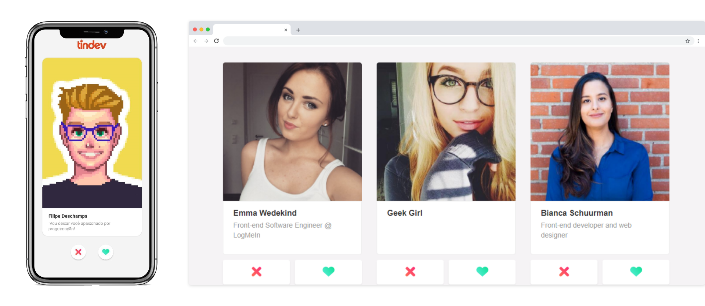
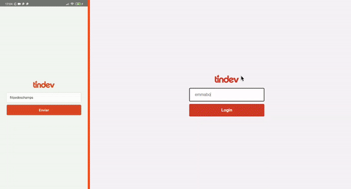

<div align="center">


<hr />
<br />

 

</div>



<p align="center">
  
</p>

## 💡 Project

Tindev as the name suggests it is a Tinder-like for Developers, a fullstack web and mobile application built using top technologies like **React**, as the front-end, **Node.js**, back-end with MongoDB, and **React-native** for our mobile app.

## 💻 Demo

[https://tindev-app.herokuapp.com](https://tindev-app.herokuapp.com/)

### 📱 App

[Download para Android](https://github.com/jeferson-sb/tindev/releases/tag/1.0.0)

## 🚀 Quick start

### Pre-requisites

- Node.js version 10.0 or greater
- Download & Install [MongoDB](https://www.mongodb.com/download-center)
- Download & Install [Mongo Compass](https://www.mongodb.com/products/compass)
- React Native: [See the environtment setup to react native](https://reactnative.dev/docs/environment-setup)

### Installation

```bash
$ cd tindev-backend
$ yarn
```

```bash
$ cd .. && cd tindev-frontend
$ yarn
```

```bash
$ cd .. && cd tindev-mobile
$ yarn
```

### Usage

> Rename `.env.example` to `.env` on backend

```bash
$ cd tindev-backend
$ yarn dev
```

> Open another terminal and run

```bash
$ cd tindev-frontend
$ yarn start
```

## ✔ To-Do

- [x] Release app 1.0.0
- [x] Slide right and Slide left feature

## 📝 License

This project is licensed under the terms of the [MIT](https://github.com/jeferson-sb/tindev/blob/master/LICENSE) license

`Made with ♥ by Jeferson © 2020`
